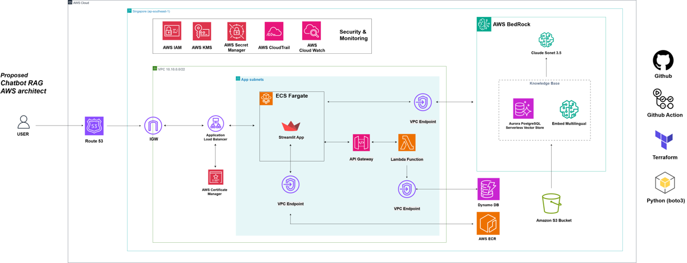
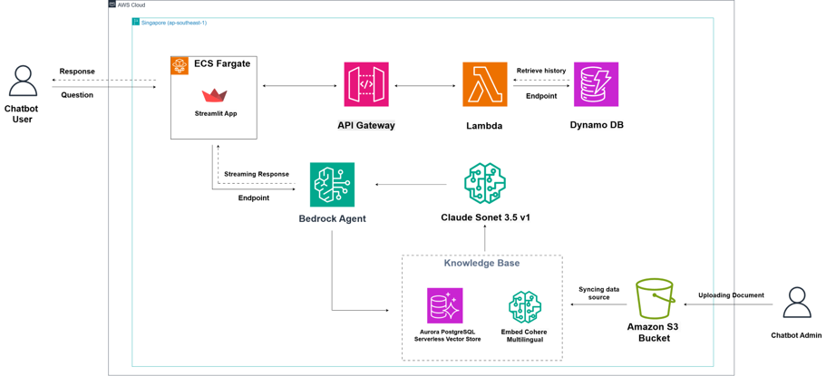
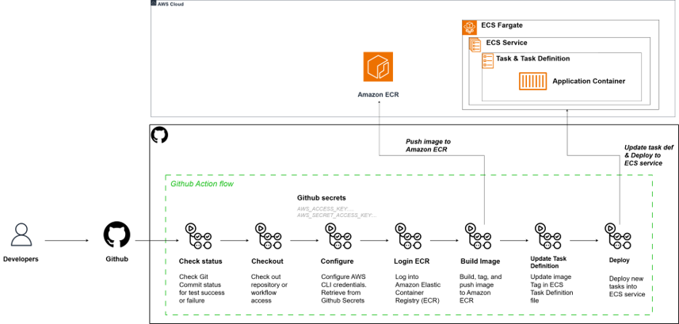

# 🎈 Streamlit + LLM Internal Chatbot

[](https://github.com/codespaces/new?repo_name=streamlit/llm-examples&quickstart=1)

Starter examples for building LLM apps with Streamlit.

## Authors

- **Lam Nguyen Dinh** - [LinkedIn](https://www.linkedin.com/in/ndinlam/)
- **Kien Luong Trung** - [LinkedIn](https://www.linkedin.com/in/carwynluong/)
- **Thuat Nguyen Danh** - [LinkedIn](https://www.linkedin.com/in/thuatnguyen/)

## Overview of the App

This application demonstrates a **Retrieval Augmented Generation (RAG)** chatbot system built for internal HR administrative support. The system leverages cutting-edge AI technologies to provide intelligent, context-aware responses based on company-specific documentation.

### Key Technologies

**AI/ML Stack:**
- **AWS Bedrock Agent**: Core AI orchestration platform for managing conversations and knowledge retrieval
- **Claude Sonnet 3.5**: Advanced language model for natural language understandinsg and response generation
- **Cohere Multilingual Embeddings**: Vector embeddings for semantic search across multilingual documents
- **Aurora PostgreSQL Vector Store**: High-performance vector database for storing and retrieving document embeddings

**Application Stack:**
- **Streamlit**: Modern web interface for seamless user interactions
- **AWS S3**: Document repository for HR policies, procedures, and administrative guidelines
- **DynamoDB**: NoSQL database for chat history and session management
- **ECS Fargate**: Containerized deployment for scalable application hosting

### RAG Architecture

The system implements a sophisticated RAG pipeline:

1. **Document Ingestion**: HR documents uploaded to S3 are automatically processed and indexed
2. **Vector Generation**: Cohere embeddings convert documents into high-dimensional vectors
3. **Semantic Search**: User queries are embedded and matched against document vectors
4. **Context Retrieval**: Most relevant document sections are retrieved from Aurora PostgreSQL
5. **Response Generation**: Claude Sonnet 3.5 generates contextual responses using retrieved information
6. **Safety Controls**: Bedrock Guardrails ensure responses remain within appropriate boundaries

### Use Cases

- **HR Policy Queries**: Quick access to company policies, procedures, and guidelines
- **Administrative Support**: Assistance with leave requests, benefits information, and onboarding
- **Document Search**: Semantic search across internal HR documentation
- **Multilingual Support**: Handling queries in multiple languages with Cohere's multilingual embeddings

### Current examples include:

- Chatbot with RAG capabilities
- Document Q&A with semantic search
- Multilingual support
- Secure chat history management
- Real-time streaming responses

## System Architecture

### Overview

This chatbot system is built on AWS Cloud infrastructure, designed to provide intelligent HR administrative support using Retrieval Augmented Generation (RAG) technology. The system leverages AWS Bedrock for AI capabilities and follows a microservices architecture pattern.



### Core Components

#### 1. User Interface Layer
- **Streamlit App**: Web-based user interface deployed on ECS Fargate
- **Application Load Balancer**: Distributes traffic across multiple application instances
- **Route 53**: DNS management and traffic routing
- **AWS Certificate Manager**: SSL/TLS certificate management for secure HTTPS connections

#### 2. API Gateway & Lambda Layer
- **API Gateway**: Single entry point for all API requests
- **Lambda Functions**: Serverless compute for business logic processing
- **VPC Endpoints**: Secure private connections to AWS services

#### 3. Data Storage Layer
- **DynamoDB**: NoSQL database for chat history and session management
- **Amazon S3**: Object storage for document repository
- **Aurora PostgreSQL Serverless**: Vector store for knowledge base embeddings

### AI Core Architecture



#### AWS Bedrock Integration

The system utilizes AWS Bedrock as the core AI engine with the following components:

**Bedrock Agent Configuration:**
- **Model**: Claude Sonet 3.5 v1 for natural language processing
- **Knowledge Base**: Custom HR document repository with multilingual support
- **Guardrails**: Content filtering and safety controls
- **Vector Store**: Aurora PostgreSQL with Cohere Multilingual embeddings

**Knowledge Base Components:**
- **Document Processing**: Automatic ingestion from S3 bucket
- **Embedding Generation**: Cohere Multilingual model for vector creation
- **Semantic Search**: Vector-based retrieval for relevant information
- **Context Augmentation**: RAG pipeline for enhanced responses

**AI Processing Flow:**
1. User query received through Streamlit interface
2. Query processed by Lambda function
3. Bedrock Agent retrieves relevant context from Knowledge Base
4. Claude Sonet 3.5 generates response using retrieved context
5. Response streamed back to user interface

### CI/CD Pipeline



#### GitHub Actions Workflow

The system implements automated deployment using GitHub Actions:

**Build Phase:**
- Code checkout from GitHub repository
- Docker image building with multi-stage optimization
- Security scanning and vulnerability assessment
- Unit and integration testing

**Deploy Phase:**
- AWS ECR image push
- ECS service update with blue-green deployment
- Health checks and rollback capabilities
- Infrastructure updates via Terraform

**Monitoring & Observability:**
- CloudWatch metrics and logging
- Application performance monitoring
- Error tracking and alerting
- Cost optimization monitoring

### Security Architecture

#### Identity & Access Management
- **IAM Roles**: Least privilege access for each service
- **VPC Security**: Private subnets with controlled internet access
- **Encryption**: Data encryption at rest and in transit
- **Secret Management**: AWS Secrets Manager for sensitive data

#### Network Security
- **VPC Configuration**: Isolated network environment
- **Security Groups**: Firewall rules for service communication
- **NACLs**: Network-level access control
- **Private Subnets**: Internal service communication

### Scalability & Performance

#### Auto-scaling Configuration
- **ECS Fargate**: Automatic scaling based on CPU/memory usage
- **Application Load Balancer**: Traffic distribution and health monitoring
- **DynamoDB**: On-demand capacity for unpredictable workloads
- **Lambda**: Automatic scaling for serverless functions

#### Performance Optimization
- **Caching**: Response caching for frequently asked questions
- **CDN**: Content delivery network for static assets
- **Database Optimization**: Indexing and query optimization
- **Streaming Responses**: Real-time response generation

### Monitoring & Logging

#### Observability Stack
- **CloudWatch**: Centralized logging and metrics
- **X-Ray**: Distributed tracing for request tracking
- **CloudTrail**: API call logging and audit trails
- **Custom Dashboards**: Real-time system health monitoring

#### Alerting & Notifications
- **SNS**: Notification service for critical events
- **CloudWatch Alarms**: Automated alerting based on thresholds
- **Error Tracking**: Detailed error logging and analysis
- **Performance Monitoring**: Response time and throughput tracking

## Installation & Setup

### Prerequisites

- Python 3.12+
- [uv](https://github.com/astral-sh/uv) - Fast Python package installer and resolver

### Run it locally

#### Setup and Installation

```sh
# Initialize uv project (if not already done)
uv init -p <python-version>

# Create virtual environment
uv venv

# Activate virtual environment
source .venv/bin/activate  # On Linux/Mac
# or
.venv\Scripts\activate     # On Windows

# Install dependencies
uv pip install -r requirements.txt

# Run the application
streamlit run Chatbot.py
```

#### Alternative: Using uv run (no activation needed)

```sh
# Install dependencies and run in one command
uv run streamlit run Chatbot.py
```

## AWS Bedrock Configuration

This chatbot uses AWS Bedrock Agent with secure credential management. **No hardcoded AWS credentials needed!**

### Security Setup

The application uses AWS SDK's default credential chain, which automatically loads credentials from:
- AWS CLI configuration
- IAM Instance Profile (EC2/ECS)
- Environment variables
- AWS SSO

### Required Configuration

Create a `.env` file with only non-sensitive variables:

```sh
AWS_DEFAULT_REGION=ap-southeast-1
AGENT_ID=your_bedrock_agent_id
ALIAS_ID=your_bedrock_alias_id
API_ENDPOINT_URL=your_api_endpoint_url
```
